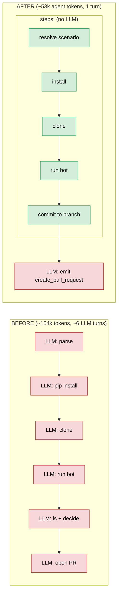
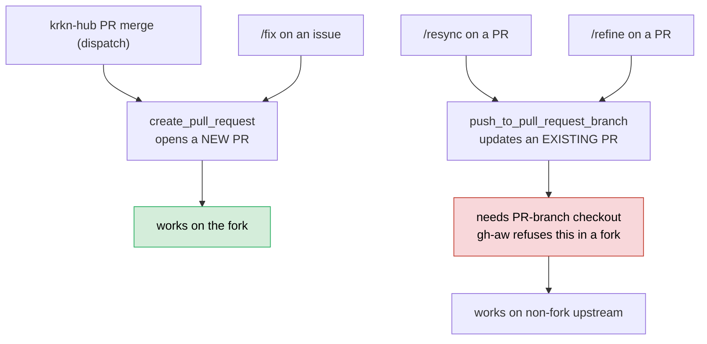

# Doc-sync retrofit: debrief

## What I set out to do vs what I shipped

The bot worked but a single run burned ~154k agent tokens because the LLM was doing all the deterministic work (parse, install, clone, generate, decide, open PR). I retrofitted it so the LLM does almost nothing, and fixed a set of correctness gaps that surfaced along the way. It now runs end to end on `gpt-4o-mini` and is gated on rendering.

| I thought | I shipped |
|---|---|
| Agent installs/clones/runs/decides/opens PR | Agent only commits the generated files and emits one safe-output; all deterministic work is plain Actions `steps:` |
| Maybe drop the LLM / flip to a pull model | Kept the scoped push + LLM architecture (mentor-approved); the LLM stays a thin, cheap publisher |
| Agent does its own git | Git runs in a `steps:` block (the sandboxed agent could not do it reliably) |
| Hidden `<!-- scenario=X -->` marker for `/resync` | Derive the scenario from the PR's own `data/params/<scenario>/` path (no marker needed) |
| Fuzzy dir-name match to place the shortcode | Exact lookup via the website's `<krkn-hub-scenario id="...">` back-link |

## Architecture: before vs after



## What I wrote (the retrofit changes)

Bot code (`bot/`):
- **`scaffold.py`**: replaced fuzzy dir matching with `<krkn-hub-scenario id>` lookup; added new-page scaffolding (`_index.md` + tabpane + tab stubs); made tabs follow the data (a source with no data gets no tab).
- **`doc_bot.py`**: `krknctl-input.json` description join, so env-only params inherit the maintainer-written description.
- Tests: `test_scaffold.py`, `test_doc_bot.py` extended. **67 tests pass.**

Workflow (`.github/workflows/doc-sync.md`, compiled to `.lock.yml`):
- All deterministic work moved into `steps:` (checkout, resolve scenario, install, clone, generate, commit).
- Agent reduced to: commit + emit one safe-output. Engine `copilot / gpt-4o-mini`.
- `roles: all` (testing), DCO `-s` sign-off, `/resync` scenario resolution from PR files.

Website (`StrikerEureka34/website_2`):
- `hugo-build.yml`: Hugo render check on every PR, main is branch-protected to require it + DCO.

## What is in each repo now

```
krkn-docs-bot-gh-aw/            (bot + workflow source)
  bot/
    doc_bot.py                  entrypoint: extract -> resolve descriptions -> emit -> scaffold
    parser.py                   env.sh + krknctl-input.json parsers
    descriptions.py             tier resolver (existing > source > LLM > placeholder)
    emitter.py                  writes data/params/<scenario>/<source>.yaml
    scaffold.py                 id-lookup, new-page creation, shortcode injection
    drift_scanner.py            weekly drift detection (add-on, not yet wired)
    github_client.py            drift's GitHub API client
  tests/                        67 tests
  .github/workflows/doc-sync.md source workflow (runtime-imported by the lock)
  docs/                         JOURNAL, PIPELINE_OVERVIEW, this debrief

StrikerEureka34/website_2       (docs site, PR target)
  .github/workflows/
    doc-sync.md + doc-sync.lock.yml   the deployed agentic workflow (both required)
    hugo-build.yml                    render gate on PRs
  layouts/shortcodes/param-table.html renders the tables from the data files

StrikerEureka34/krkn-hub        (source of truth + trigger)
  <scenario>/env.sh + krknctl-input.json
  .github/workflows/trigger-docs-sync.yml   dispatches doc-sync on merged PRs
```

## Features working (validated by real runs)

| Feature | Status | Proof |
|---|---|---|
| Cheap model (`gpt-4o-mini`) end to end | working | [run 28739103496](https://github.com/StrikerEureka34/website_2/actions/runs/28739103496) |
| Dispatch trigger (krkn-hub merge) | working | krkn-hub [#41](https://github.com/StrikerEureka34/krkn-hub/pull/41) -> [run 28749744315](https://github.com/StrikerEureka34/website_2/actions/runs/28749744315) |
| `/fix <scenario>` on an issue | working | [run 28751100724](https://github.com/StrikerEureka34/website_2/actions/runs/28751100724) -> PR [#40](https://github.com/StrikerEureka34/website_2/pull/40) |
| id-map (divergent name -> right page) | working | node-cpu-hog -> cpu-hog-scenario, PR [#38](https://github.com/StrikerEureka34/website_2/pull/38) |
| New-page scaffolding | working | rollback had no page, one was created |
| Description join (real descriptions) | working | `krkn-hub.yaml` shows real prose, not placeholders |
| DCO sign-off + Hugo render gate | working | both required checks pass on PR #38 |
| `/resync`, `/refine` (update a PR) | blocked on fork only | see caveats |

## Command routing (and the one caveat)



## How the parameters work

Extraction is deterministic. Descriptions resolve by tier, the LLM is a last resort:

```
existing description in the data file   (never re-churned on a re-run)
  -> krknctl-input.json description      (maintainer-written, authoritative)
    -> LLM one-liner                     (only for params with no source description)
      -> "Configures <param>." placeholder
```

Real output for a scenario with no page before (`rollback`), both params correct:

```yaml
- name: RUN_UUID
  description: Krkn Run UUID that needs to be rolled back.   # from krknctl-input.json join
  default: ''
- name: DEMO_ROLLBACK_DELAY
  description: Configures demo rollback delay.               # env-only, so placeholder
  default: '30'
```

## Two runs, walked through

**Run A: a brand-new scenario page (`rollback`).**
- Trigger: I merged krkn-hub PR [#41](https://github.com/StrikerEureka34/krkn-hub/pull/41), which touched `rollback/env.sh`. Any merged PR to a scenario's config fires `trigger-docs-sync`, which dispatches doc-sync to website_2.
- Action: [doc-sync run 28749744315](https://github.com/StrikerEureka34/website_2/actions/runs/28749744315).
- Output PR: website_2 [#38](https://github.com/StrikerEureka34/website_2/pull/38) "[docs-sync] Open rollback scenario".
- What and why: `rollback` had no website page and no data yet. Expected: the bot creates a brand-new page and both tabs, generates `krkn-hub.yaml` + `krknctl.yaml`, `DEMO_ROLLBACK_DELAY` shows up, `RUN_UUID` inherits its description from the join. That is exactly what happened. Expected and correct.

**Run B: changing an existing parameter (`container-scenarios`).**
- Trigger: I merged krkn-hub PR [#42](https://github.com/StrikerEureka34/krkn-hub/pull/42), changing `EXPECTED_RECOVERY_TIME` default from `60` to `120` in `container-scenarios/env.sh`.
- Action: [doc-sync run 28751607781](https://github.com/StrikerEureka34/website_2/actions/runs/28751607781).
- Output PR: website_2 [#41](https://github.com/StrikerEureka34/website_2/pull/41).
- What and why: an existing param's default changed, and this scenario still had a hand-written table. Expected: the bot deletes the hand table, injects the shortcode, and writes the new value into the data. That is exactly the diff:

```diff
- EXPECTED_RECOVERY_TIME | Time to wait ... recover properly | 60
+ 
```
```yaml
# data/params/container-scenarios/krkn-hub.yaml (generated)
- name: EXPECTED_RECOVERY_TIME
  description: Time to wait before checking if all containers that were affected recover properly
  default: '120'
```
The old hand table (with `60`) is gone, the shortcode renders from the data, and the new value `120` is in the data file. The description was untouched, it comes from `krknctl-input.json`, not the changed line.

## Source of truth vs hand-written prose

The bot treats `krknctl-input.json` as the **authoritative source** for descriptions. On a scenario's first migration it deletes the old hand-written markdown table and renders from the data instead. The two can disagree:

| Param | Old hand-written table | krknctl-input.json (what the bot uses) |
|---|---|---|
| DURATION (application-outages) | "Duration in seconds after which the routes will be accessible" | "Set chaos duration (in sec) as desired" |

So a migration can replace a more specific hand description with a more generic source one.

**Decision: keep the JSON authoritative, do not preserve the hand prose.** The point of the bot is to kill drift; preserving hand-maintained prose perpetuates it, and if a JSON description reads weak the right fix is upstream in `krknctl-input.json`, which the bot makes visible. This is separate from **re-run preservation**, which the bot does do: once a description is in the generated data file, later runs keep it (only new params get (re)described), so edits to the generated data are safe. Only the original hand table is replaced.

## Difficulties and how I fixed them

**1. Compile caught a credential leak.** Strict mode refused the checkout:
```
error: actions/checkout without 'persist-credentials: false' ... the git token is leaked to the agent
```
Fix: `with: { persist-credentials: false }`. Lesson: `gh aw compile` is the real gate, not the docs.

**2. The branch saga (three runs to get right).** The agent, not steps, handled git at first:
- Agent committed to `main` -> `create_pull_request` failed: *"Branch 'main' equals base_branch 'main'"*.
- Agent named a branch but did not commit -> *"branch 'docs-sync-x' does not exist locally"*.
- Agent did `git checkout -b` inside the sandbox -> hit a stale `.git/index.lock`, tried `rm` (not an allowed tool) -> died.

Fix: take git away from the agent and do it in a `steps:` block on the runner:
```yaml
- name: Commit generated files to a branch
  run: |
    git config user.name "krkn-docs-bot"
    git config user.email "krkn-docs-bot@users.noreply.github.com"
    git checkout -b "docs-sync-${{ github.run_number }}"
    git add -A
    git commit -s -m "docs-sync: $SCENARIO parameter tables"
```

**3. Doc-sync PRs failed the DCO check.** The commit had no sign-off. Fix: added `-s` to the commit above.

**4. A source with no data still got an empty tab.** Data emission was conditional (`if recs:`) but tab creation was not. Fix: scaffold now keys off the data files:
```python
sources = [s for s in ("krkn-hub", "krknctl")
           if (root / "data" / "params" / scenario / f"{s}.yaml").exists()]
```

**5. `/resync` failed with an empty scenario.** A bare `/resync` has no scenario word. Fix: derive it from the PR:
```bash
if [ -z "$scenario" ] && [ -n "$PR_NUMBER" ]; then
  scenario="$(gh api "repos/$REPO/pulls/$PR_NUMBER/files" --jq '.[].filename' \
    | grep -oE 'data/params/[a-z0-9-]+/' | head -1 | cut -d/ -f3)"
fi
```

**6. `/resync` still blocked, but not by my code.** gh-aw refuses PR-branch checkout in a fork: *"Refusing PR checkout in forked repository runtime context."* website_2 is a fork of krkn-chaos/website. This guard disappears on the non-fork upstream, so `/resync` and `/refine` are non-fork features.

**7. Descriptions "looked rewritten."** Expected, not a bug. See the "Source of truth vs hand-written prose" section above.

## Cost

| | Before | After |
|---|---|---|
| Agent | ~154k tokens, ~6 turns | ~53k tokens, 1 turn |
| Threat-detection scan | separate LLM job | unchanged (~68k, kept on for the demo; one-line off in the workflow if wanted) |

## Deferred / not built

- `/refine` (the human-gated description reword) is still a sketch (`doc-refine.md`); it will inherit the same fork limitation as `/resync` until it runs on the non-fork repo.
- Drift-detection weekly cron: code exists (`drift_scanner.py`), not wired to a schedule yet.
- `krkn/config.yaml` as a third source: not implemented (Phase 1 scope).
